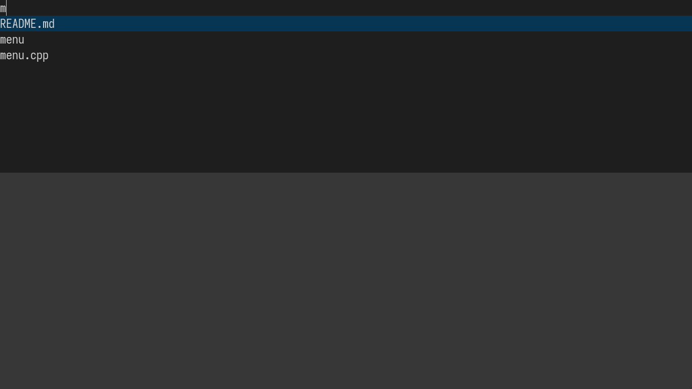

# Menu
Selection Menu in C++



## Quick Start
Depends on X11 and Xft.

```console
$ ./build.sh
$ ls | ./menu
```

## Keybindings
| Key                    | Description                               |
| ---                    | -----------                               |
| <kbd>Escape</kbd>      | Quit                                      |
| <kbd>Enter</kbd>       | Accept selected match                     |
| <kbd>Backspace</kbd>   | Delete a character left of the cursor     |
| <kbd>C-n</kbd>         | Select the next match                     |
| <kbd>C-p</kbd>         | Select the previous match                 |
