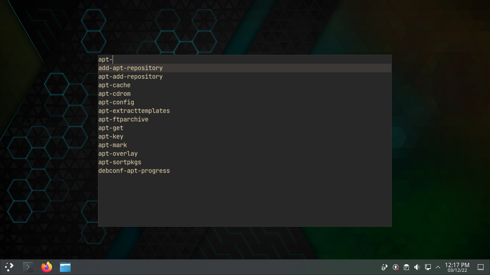

# Menu
Selection Menu in C++



## Quick Start
```console
$ sudo apt install build-essential libx11-dev libxft-dev
$ ./build.sh
$ ls ~ | ./menu
```

## Keybindings
| Key                    | Description                               |
| ---                    | -----------                               |
| <kbd>C-c</kbd>         | Quit                                      |
| <kbd>Enter</kbd>       | Accept selected match                     |
| <kbd>C-b</kbd>         | Move the cursor left a character          |
| <kbd>C-f</kbd>         | Move the cursor right a character         |
| <kbd>M-b</kbd>         | Move the cursor left a word               |
| <kbd>M-f</kbd>         | Move the cursor right a word              |
| <kbd>C-a</kbd>         | Move the cursor to the start of the input |
| <kbd>C-e</kbd>         | Move the cursor to the end of the input   |
| <kbd>C-n</kbd>         | Select the next match                     |
| <kbd>C-p</kbd>         | Select the previous match                 |
| <kbd>Backspace</kbd>   | Delete a character left of the cursor     |
| <kbd>C-d</kbd>         | Delete a character right of the cursor    |
| <kbd>M-Backspace</kbd> | Delete a word left of the cursor          |
| <kbd>M-d</kbd>         | Delete a word right of the cursor         |
